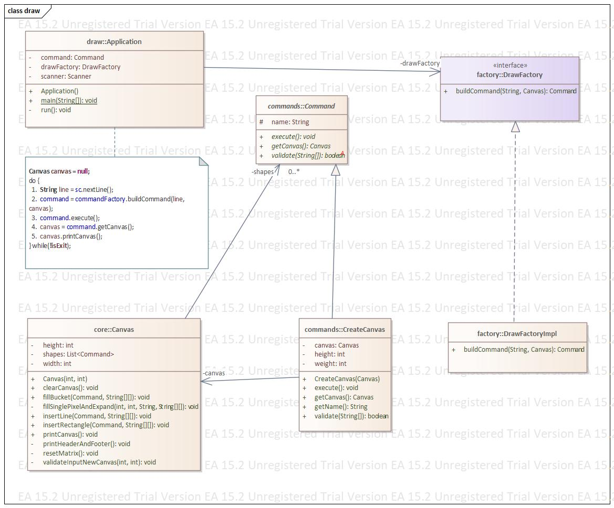

# *** The Problem ***
 
  ##Description
Below is a coding problem that we would like you to solve. Please read through the description carefully and implement a solution for it. 
We don't want you to over­engineer the solution but be prepared to extend the functionality in the next step of the interview process. Finally, we ask you to submit a solution that you'd be happy to go live with and works "out of the box”.

You're given the task of writing a simple console version of a drawing program. In a nutshell, the program should work as follows:
1. create a new canvas
2. start drawing on the canvas by issuing various commands
3. quit

At the moment, the program should support the following commands:
- __C w h__ Should create a new canvas of width w and height h.
- __L x1 y1 x2 y2__ Should create a new line from _(x1,y1)_ to _(x2,y2)_. Currently only horizontal or vertical lines are - supported. Horizontal and vertical lines will be drawn using the 'x' character.
- __R x1 y1 x2 y2__ Should create a new rectangle, whose upper left corner is _(x1,y1)_ and lower right corner is _(x2,y2)_. Horizontal and vertical lines will be drawn using the 'x' character.
- __B x y c__ Should fill the entire area connected to (x,y) with "colour" c. The behaviour of this is the same as that of the "bucket fill" tool in paint programs.
- __Q__ Should quit the program.

Below is a sample run of the program. User input is prefixed with `enter command:`.
```
enter command: C 20 4
----------------------
|                    |
|                    |
|                    |
|                    |
----------------------

enter command: L 1 2 6 2
----------------------
|                    |
|xxxxxx              |
|                    |
|                    |
----------------------

enter command: L 6 3 6 4
----------------------
|                    |
|xxxxxx              |
|     x              |
|     x              |
----------------------

enter command: R 16 1 20 3
----------------------
|               xxxxx|
|xxxxxx         x   x|
|     x         xxxxx|
|     x              |
----------------------

enter command: B 10 3 o
----------------------
|oooooooooooooooxxxxx|
|xxxxxxooooooooox   x|
|     xoooooooooxxxxx|
|     xoooooooooooooo|
----------------------
```
---
---

# Solution

### Project Structure
For the implementation of the _drawing program_ we need the following _components_:
- A parser for parsing the input typed by the user into commands and for this we use `DrawFactory`.
- A new `Command` class for each command we want to add to the drawing program.
- A class which define the state of the program and for this we use `Canvas`.

If we try to model the implementation using the command pattern described by _GoF_ we have: 
- `Application.java` as _invoker_.
- package `commands` contains all _concrete commands_.
- `Canvas.java` the _receiver_ which defines what to do on each command receiver. 

Example of _"create new canvas"_ implementation:



If we try to read the UML diagram:
1. User types in the console `C 10 5` (ex)
2. The concrete command `CreateCanvas` is created.
3. `CreateCanvas.execute()` creates `new Canvas(widht, heigh)`;
4. Get the updated state of the object `Canvas`.
5. Print the new state.

The project is composed by the following packages:
- `com.draw`  Entry point of the application.
- `com.draw.command` All commands supported by the application.
- `com.draw.core` Core of the application, `Canvas.java` in this case.
- `com.draw.exception` All _checked exceptions_ thrown by the application.

---
###	filler "algorithm"
The approach used for filling the area, in `BucketFill`, is as follows:
1. Call the method which fill only one pixel (if free)
2. Call recursively same method for the 4 adjacent pixels: x+1, y; x, y+1; x-1, y; x, y-1.
3. Method exits when finds borders or already a filled pixel.
		
__Complexity of the algorithm__  <br/>
The complexity of the algorithm is _NumberOfFreePixels x 4_.<br/>
If we have an empty _Canvas[20x5]_, the filler will make 400 calls, so 400 __accesses__ to the _matrix[][]_.<br/>
Number of __updates__ to the _matrix[][]_ is equal to the number of pixels to be colored.
	
###	Tests

Choose `TDD approach` for Canvas implementation. This means the TestCases had been created before or during the development phase and not in the end.
 
For each functionality is present a different test file:
- `BucketFillTest.java` Test cases for BucketFiller command.
- `LineTest.java` Test cases for drawing a line command.
- `RectangleTest.java` Test cases for drawing a rectangle command.
- `UseCaseTest.java` Test cases covering bugs discovered in ta second moment.

Unit tests are divided in three categories:
-  `Happy Paths` _testHP_nomeTest_ wich are the tests that has to succeed. Usually we assert at the end of the method what we are expecting
- `Case Limit` _testCL_nomeTest_ wich are the tests that test a Limit Case. Example, x, y are 0 ore same as width/height. Usually we assert what we are expecting or pay attention of eventual exceptions
- `Exceptions` _testEX_nomeTest_ wich are the tests that test exception cases. In this cases we define the exception we are waiting to be thrown.

In case of new enhancements or different implementation for the Canvas.java the unit tests will act as Integration Tests. 
Before committing new changes to repository everything must be "green" :) 

### Logging
`Log4j` logging will be output in the file `./logs/canvas.log` so in this way we leave the console free for interactions. <br/> 
In a real application would be a better idea to trace in the _log file_ all (almost) interactions present in the console in order that the developer can follow step-by-step the user's flow until an eventual `Exception` may occur.<br/>
For keeping the code cleaner will print in the log file only user input and eventual errors.<br/>
Tracing the flow as describer before means each `System.out.println()` will follows a `logger.debug()`.

###	A Working build
Using maven plugin `maven-jar-plugin` we can package our application in `canvas.jar`.
If you want to create a new jar use:
```
mvn clean install
``` 

A working build is present in the path `./dist`:
- `canvas.jar` -> application packaged as a jar file.
- `canvas.bat` -> easy and fast way to test the application.

Run:
Application supports max canvas size is 200 x 50, it can be configured by Command Line arguments or by updating canvas.bat file. Width and Height parameters are numeric. Invalid params will set canvas size to default( 200 x 50).
```
java -jar canvas.jar width height
``` 
```
cd /yourpath/canvas/dist
canvas.bat
```